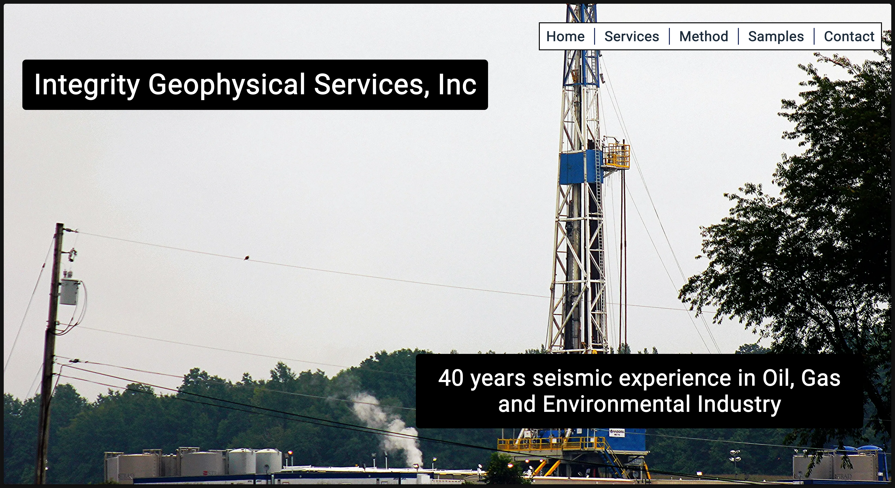
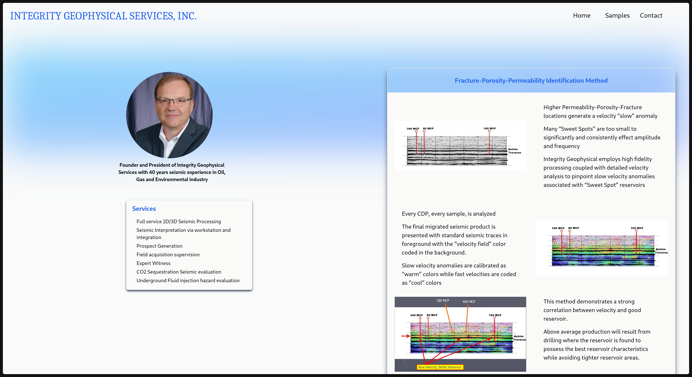
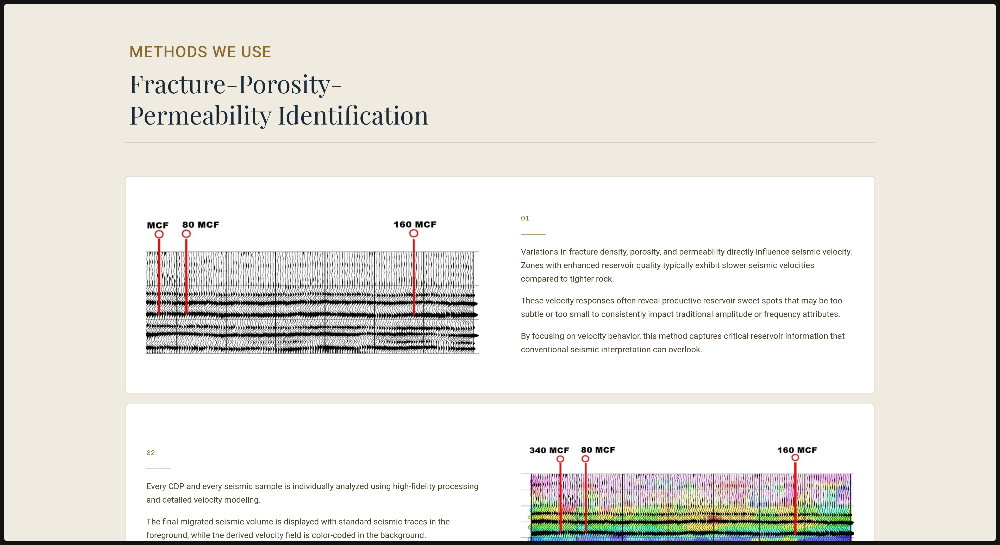

# Key Engineering Decisions

This section highlights the key engineering decisions made during the redesign, with a focus on how trade-offs were evaluated in the context of a relatively small, content-driven application.

Rather than optimizing for scale or complex functionality, decisions were guided by the need for clarity, maintainability, and alignment with business goals. This required balancing structure and consistency with the risk of overengineering.

Each decision reflects a deliberate choice between competing approaches, emphasizing pragmatic solutions that supported long-term maintainability without introducing unnecessary complexity.

---

### 1. Designing for Trust and Credibility

#### Context
The original site lacked a clear first-impression layer, with no defined hero section or structured entry point. As a result, users were immediately presented with dense content without a clear understanding of what the company does or why it should be trusted.

In a technical, business-facing industry, this created a gap in credibility during the initial interaction.

#### Options Considered
- Maintain a content-first layout without a defined entry point  
- Introduce a structured hero section to clearly communicate value and establish trust immediately

*Final hero section implementation focusing on clarity and first-impression trust:*

#### Decision
A dedicated hero section was introduced to serve as a clear entry point for the site. This section was designed to quickly communicate the company’s core services, reinforce professionalism, and establish credibility within the first interaction.

The layout prioritized concise messaging, strong visual hierarchy, and minimal distractions to guide user attention effectively.

#### Trade-offs
Introducing a hero section reduced the amount of content visible above the fold. However, this trade-off improved clarity and ensured users were not overwhelmed upon entry.

#### Impact
The redesigned entry point provides immediate context and establishes trust early, making it easier for users to understand the company’s services and engage with the rest of the site.

### 2. Improving Information Flow and Content Direction

#### Context
Beyond the initial entry point, several sections of the original site contained dense informational content with limited visual hierarchy or guidance. Users were required to actively search for meaning rather than being guided through the information.

This made it difficult to quickly understand services and reduced overall readability, especially in content-heavy sections.

*Example of dense informational layout in the original design:*

#### Options Considered
- Preserve a dense, text-heavy layout where users self-navigate information  
- Introduce structured layouts that guide users through content with clear hierarchy and grouping

*Example of improved guided content structure:*

#### Decision
The redesign introduced clearer information flow through structured sections, improved spacing, and intentional grouping of related content. Each section was designed to guide the user’s eye naturally through the information rather than presenting it as a block of unstructured text.

#### Trade-offs
This approach required reducing some content density in favor of clearer structure. Some information was condensed or reorganized to improve readability.

#### Impact
Users can now navigate complex service information more easily, with a clearer understanding of hierarchy and progression through the content.
