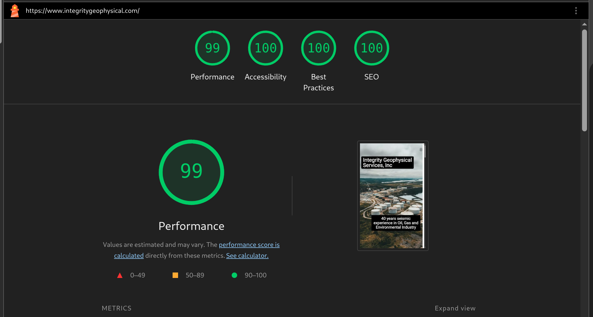
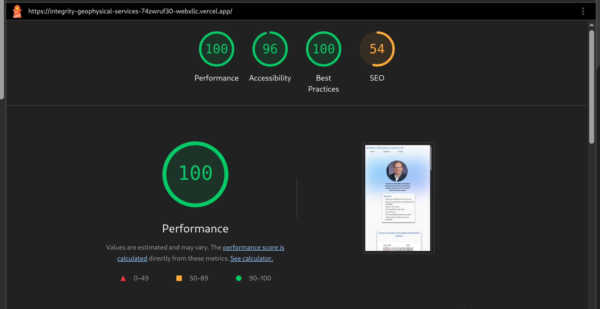

# Performance

Performance improvements were evaluated using Lighthouse audits in Chrome DevTools. The results below compare the redesigned implementation with the original version of the site.

---

### Redesigned Implementation:

### Original Implementation:

The original implementation showed lower performance scores due to:

- dense and unstructured layouts  
- inconsistent component patterns  
- unstrutured semantic HTML   
- lack of a cohesive design system

---

## Key Improvements
Several structural and design decisions contributed to the performance gains:

### 1. Simplified Layout Structure

Layouts were restructured to reduce unnecessary nesting and improve overall DOM efficiency. This resulted in fewer layout recalculations and improved rendering performance.

### 2. Consistent Design System

Introducing a centralized design system reduced one-off styling and eliminated redundant CSS patterns. This helped create a more predictable and efficient rendering process.

### 3. Improved Semantic HTML Structure

The markup was refactored to use more meaningful semantic HTML elements, improving both accessibility and how content is interpreted by search engines.

Rather than treating HTML as purely structural, the redesign focused on aligning the markup with the actual content hierarchy of the site.

This included:

- establishing a consistent heading hierarchy (h1 → h2 → h3)  
- improving form labeling and accessibility attributes  
- structuring sections using semantic elements that reflect the purpose of the content  

These changes help browsers, assistive technologies, and search engines better understand the structure of the page, contributing to improved accessibility and SEO-related Lighthouse scores.

### 4. Purposeful Use of Motion

Animations were used sparingly and implemented to enhance usability rather than decorate the interface. This avoided unnecessary performance overhead from excessive or complex animations.

---

## Impact

These changes resulted in improved Lighthouse scores across performance, accessibility, and best practices.

More importantly, the site now delivers a faster and more stable user experience, particularly during initial load and content rendering.
